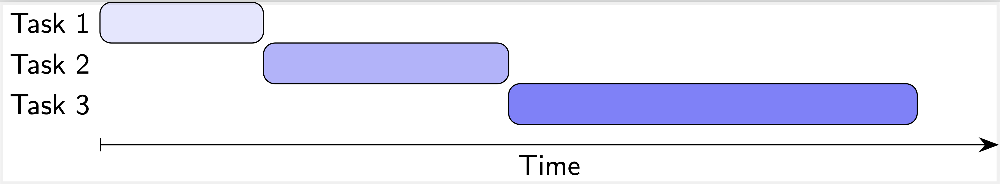

# PDC@UNL
## Module 1.0
**[School of Computing](https://computing.unl.edu/)**  
**[College of Engineering](https://engineering.unl.edu/)**  
**[University of Nebraska-Lincoln](https://unl.edu)**  

# Background

*Multitasking* can save a lot of time when performing everyday tasks.  When
cooking, while waiting for the water to boil you don't just stand around
watching the pot; you perform other tasks (cutting vegetables, measuring
pasta, etc.).  With larger more complex jobs, you may have multiple people
working together.  A restaurant would employ multiple staff - a chef to
prepare entrees, another to prepare deserts, etc.  Each person performs
a different task *at the same time*.  Having more individuals performing
tasks doesn't reduce the actual amount of *work*, it just makes it
possible to complete the work in a shorter amount of time.

In computing, these concepts are similar.  In general, only one process,
task, or operation can be performed on a single processor at a time.  
However, if an operation (boiling water) needs to complete before a
task (cooking) can be completed, the processor can switch what it is
doing so that it is not "idle" until the operation is completed.  Similarly,
modern computers have multiple processors or cores that enable them to
perform multiple tasks at once *in parallel*.  Just as with preparing food,
the total amount of work is not reduced, but we may be able to execute
all the work in a shorter amount of actual time.

## Sequential Computing

**Sequential Computing** is the usually the default way we think about computing.
A program's statements are executed one after the other.  For example, if we
consider the following "code":

```text
statement A;
statement B;
statement C;
```

each statement would execute in the order they are written: first `A` then
`B` then `C`.  In addition, the next statement would only execute after the
previous statement has *completely finished*.  If a statement
consisted of more than one operation, for example an addition and a subtraction:

```text
r = x + y - z;
statement B;
```

the entire expression would be evaluated and assigned to the variable `r` before
statement `B` would begin.  We can visualize these operations as more general
*tasks* that have to be completed one after the other as *time* moves forward.



As you can see only one task is executed at any one moment of time and each
task executes *fully* before the next task begins.

## Concurrency

Sequential computing is somewhat limiting, it means that only one thing can be
done at a time even if those things *could* be done at the same time.  If you
only have the ability to do one thing at a time then it doesn't really matter
but if you do have the ability to *multitask* and do more than one thing at the
same time then it has the potential to speed up

*Concurrency* is the ability for different tasks (or different parts of a program
or algorithm) can be executed out-of-order without affecting the results.  
Concurrency can take several different forms in computing.  

## Asynchronicity

A program may need perform several tasks that do not necessarily need to be
done sequentially.  This is often the case in *user interfaces* in which a
human user can interact with a program in multiple different ways.  A word
processor allows you to continue typing as it is saving your document.  A
game allows you to continue playing as it generates and controls enemies around
you.  These tasks are usually performed *asynchronously*: tasks are
performed concurrently without *blocking* the execution of other tasks.  

With sequential computing, the second task was prevented from starting or
executing before the first task was complete.  However, with asynchronous
execution, two tasks can be interleaved:

HERE

In this example, Task 1 executes for a time and then is *blocked* while
Task 2 executes.  Then, Task 1 takes over again and the trade-off continues
until each task is done.  At any one time, only one task is executing,
but they can be done asynchronously.  This gives a huge advantage with
respect to saving time.  Suppose one task has to wait for the result of
another task.  If the task simply continued executing by doing nothing
while it waited for the result it would be waiting and prevent
or "block" other tasks from executing.  Instead of this "busy waiting",
it can pause its execution and allow another task to execute while it waits.

## Parallel Computing

Another way that concurrency can be achieved is through parallel computing.
This is when more than one task executes *at the same time*.  

HERE

This generally requires that each task execute on a different processor or
core.  However, the advantage is clear: with the ability to execute more
than one task at the same time, the overall time required to complete all
tasks can be reduced significantly.  For example, if the time required to
complete all tasks in parallel is 20 seconds and we evenly divide it
among 4 processors, the total "wall clock" time would only be 20 / 4 = 5
seconds!

Of course we have omitted a lot of details and issues surrounding concurrent
programming (some problems may not even be able to be solved using concurrency!).
However, this is enough of an introduction to get started with some codeless
demonstrations.  

# Asynchronous Computing Demonstrations

## Slowing Things Down

Ironically, sometimes we want *slower* computations, or more accurately, we
want a computation to occur over a specific amount of time that can be perceived
by the human eye.

Open the `Async Demo 1` page (it should launch in a new tab).  This demo
page presents two ways of "dissolving" and image (making it more transparent
until it disappears).  

1. Read the pseudocode provided for the sequential method and then click the
   button to try the demo and observe the results.
2. Read the pseudocode provided for the asynchronous method and then click the
   button to try the demo and observe the results.
3. Answer the following questions:
   - How did the results differ?  Which one was better from a human perspective?
   - Why did you not observe a graduate transition in the sequential demonstration?
   - In the asynchronous demonstration, do you think the "waiting" was blocking
     (it prevented other tasks from executing) or not?  What would be the effect
     if it were blocking?

## User Interface Playground

Open the `Async Demo 2` page.  This demonstration will show the differences
between a sequential task that *blocks* and an asynchronous task that doesn't.

1. Interact with the `Say Hello!` button and the `Action` drop down to see how
   they work.
2. Click the `Sequential Operation` button which will perform an "expensive"
   sequential computation.  While it is executing attempt to interact with the
   `Say Hello!` button and the `Action` drop down.  You can rerun the sequential
   operation as many times as you need to observe the results.
3. Now click the `Asynchronous Operation` button which will perform an
   asynchronous computation by connecting to a remote server.  Again, while it is
   executing, attempt to interact with the
   `Say Hello!` button and the `Action` drop down.  
4. Answer the following questions:
  - What did you observe when trying to interact with the interface while the
    sequential operation was executing?
  - What did you observe when trying to interact with the interface while the
    asynchronous operation was executing?
  - What are the consequences of sequential vs asynchronous operations?

# Parallel Computing Demonstration

Open the `Parallel Demo` page.  This is a simulation/visualization of parallel
computing.  The simulation will generate a certain number of tasks and place
them in a "job queue" where they will wait to be executed.  You can select
the number of tasks to generate as well as how long they will take to execute
(you can make them all take the same number of seconds 2-6 or they will
be randomized by default).  You can also specify how many processors each
simulation will have.

1. Run the simulation with only 1 processor and 10 tasks and observe the results.  Note
   that the total CPU time (upper right) is equal to the total "wall clock" time.
2. Run the simulation again with 2 processors and the same number of tasks.  
3. Run the simulation again with 4 processors.
4. Play around with the simulation with a different number of tasks, processors and
   time(s) and answer the following:
  - When you went from 1 processor to 2 processors what was the difference in the
    *elapsed time* you observed?  When you went from 2 processors to 4 what was
    the difference observed?
  - When you went from 1 processor to 2 processors what was the difference in the
    *CPU time* you observed?  When you went from 2 processors to 4 what was
    the difference observed?
  - Was the work (number of tasks) always equally distributed among all the processors?
    Why or why not?
  - Was the work (total time) always equally distributed among all the processors?
    Why or why not?
